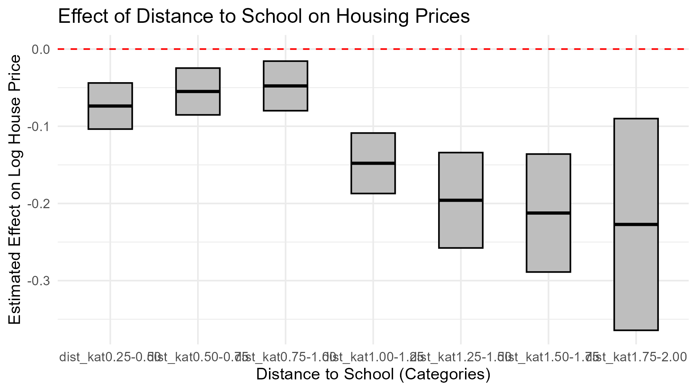

# Impact on price for Distance to next Elementary School
This project sets the focus on flats instead of house like in the works that 
is done by Hörning und Schäfer (2025). We concentrate
on apartements in North Rhine-Westphalia, which is with its 18 Million inhabitant 
the largest federal State in Germany. 

Thereore we took the data provided by the RWI in which they 
gathered data over the online-platform "Immobilien-Scout24" which is
Germanies largest online Platform for real estate. The data for schools that we have used
was provided by the ministry for schools in NRW. We only looked at primary schools in our model.
We differentiated in flats that are bought and rented to show the different impact for both types of flats.
We use a one kilometer threshold as our treatment effect for wheter a school 
has an influence on the flat price per squaremeter or not. Furthermore we 
construct a hedonic price function to control for diffrent charactaristics of 
the appartments. 

We find out that the distance to school on a one kilometer radius has a significant
influence on the price per square meter as well as on the rent per square meter. 

